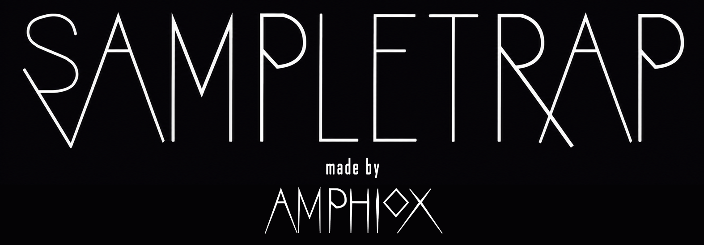

# SampleTrap

SampleTrap is a low-latency instant sampler VST. It is designed for live use at a 64-sample buffer.



Status: alpha. Interfaces and saved-state compatibility may change before 1.0.

## Version 1

- 1 to 16 active pads
- Fixed five-second capacity per pad, allocated only in `prepareToPlay`
- Direct, sample-accurate MIDI Note On and Note Off handling
- Per-pad MIDI Learn with no factory note assignments
- Record Arm: hold an assigned note to record, release it to stop
- ONE SHOT mode plays the complete recording
- HOLD mode stops playback on note release with a fixed 32-sample click-suppression ramp
- Sixteen stable automatable parameters named `Pad 1 Gate` through `Pad 16 Gate`
- MIDI assignments persist with plugin state; right-click a pad to clear its assignment
- Keys 1 through 8 control pads only in the Standalone build for testing
- Input Monitor defaults off to prevent feedback while recording
- Zero reported plugin latency

Sample audio is intentionally held only in memory and is not restored with the DAW session yet.

## Build on macOS

```sh
cmake -S . -B build-debug -DCMAKE_BUILD_TYPE=Debug
cmake --build build-debug -j
```

Standalone:

```sh
./build-debug/SampleTrap_artefacts/Debug/Standalone/SampleTrap.app/Contents/MacOS/SampleTrap
```

VST3 bundle:

`build-debug/SampleTrap_artefacts/Debug/VST3/SampleTrap.vst3`

## Build on Windows

With Visual Studio 2022's Desktop development with C++ workload installed:

```powershell
cmake -S . -B build -G "Visual Studio 17 2022" -A x64
cmake --build build --config Release -j
```

Standalone:

`build\SampleTrap_artefacts\Release\Standalone\SampleTrap.exe`

VST3 bundle:

`build\SampleTrap_artefacts\Release\VST3\SampleTrap.vst3`

## MIDI Learn

Enable `MIDI LEARN`, click a pad, then play the desired MIDI note. The assignment appears on the pad. Right-click the pad to clear it. Route MIDI directly to SampleTrap in the host; Ableton's global MIDI mapping toggles variable parameters on Note On and does not carry the Note Off behavior required here.

See `REQUIREMENTS.md` for the complete behavior and acceptance checks.

## Author

Created by Jesse Manser / AMPHIOX.

## Licence

SampleTrap is free software released under the GNU Affero General Public License v3.0 only (`AGPL-3.0-only`). JUCE is used under its AGPLv3 licence. See `LICENSE` and `THIRD_PARTY_NOTICES.md`.
